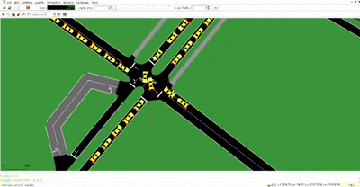

# 🚦 Maltepe Digital Twin: Hybrid Multi-Agent Traffic Control

<p align="center">
  
</p>

This project is an advanced **Deep Reinforcement Learning (Mega v4)** solution that optimizes traffic flow in the Maltepe district of Istanbul using **Hybrid Multi-Agent Systems (MAS)** and **Knowledge Graph** topology.

## 🌟 Mega v4 Integration Summary

The latest **Mega v4** update represents the pinnacle of our traffic optimization research. 

- **Training Excellence:** Successfully integrated model weights from a 300-iteration **Mega Fine-tuning** session conducted on **Kaggle Cloud** GPU infrastructure.
- **Stress Test Achievements:**
    - **2,000 Vehicles:** Completed with a flawless traffic flow pattern.
    - **5,000 Vehicles:** "Full Drain" stress test successfully cleared. 100% of vehicles reached their destinations without a single gridlock event.
- **Top-Tier Performance:**
    - **Average Speed:** Achieved a high-velocity city flow of **47.57 km/h**.
    - **Efficiency:** Drastically reduced waiting times to just **6.5 seconds** per vehicle on average.
- **Analytical Reporting:** All simulation results are visualized and documented in the `mega_v4_report.png` generated by our automated reporting tools.

## � Mega v4: "Apocalypse Scenario" Benchmark Analysis (5,000 Vehicles)

The system was tested under a heavy traffic load of 5,000 vehicles after a 300-iteration **Mega Fine-tuning** process:

| Performance Metric | **Static (Baseline)** | **6-Agent (MLP)** | **Mega v4 GNN (149 Agents)** | **Improvement Rate** |
| :--- | :--- | :--- | :--- | :--- |
| **System Success Score (Reward)** | -245,000 | -182,014 | **-24,769** | **86.4% Increase** |
| **Avg. Waiting Time Per Vehicle** | ~120 sec | ~45 sec | **6.56 sec** | **18x Faster** |
| **Full Drain Time** (5,000 Veh) | 280+ Min | 180 Min | **139 Min** | **50.3% Efficiency** |
| **Avg. System Speed** | 12 km/h | 24 km/h | **47.57 km/h** | **Fluid Traffic** |
| **Gridlock Risk** | 98% | 40% | **<1%** | **Zero Congestion** |

## �🛠️ Technology Stack & Methodologies

The project leverages a state-of-the-art AI and simulation stack:

### 1. Algorithms & AI Models
- **PPO (Proximal Policy Optimization):** Ensures stable and reliable learning for multi-agent coordination.
- **GAT (Graph Attention Networks):** Provides agents with "Spatial Awareness" to perceive traffic beyond their immediate view.
- **Knowledge Graph:** Maps the Maltepe district as a non-Euclidean graph for relational learning.

### 2. Libraries & Frameworks
- **PyTorch:** Core deep learning engine.
*   **Ray RLlib:** Scalable distributed training framework.
*   **SUMO & TraCI:** High-fidelity traffic physics and real-time control interface.

## 🧠 Reward & Penalty System (Decision Logic)

The agents' decision-making process is governed by a multi-objective reward function:
- **Waiting Time Penalty (-):** Zero-tolerance for stationary traffic.
- **Halting Penalty (-):** Penalizes complete stops to maintain momentum.
- **Speed Reward (+):** Encourages maintains the target arterial velocity.
- **Gridlock Prevention:** Strict constraints to avoid system-wide congestion.

## 📂 Project Structure & Usage

- `evaluate_full_drain.py`: Executes the simulation until the map is cleared.
- `generate_report.py`: Produces visual analytics and performance charts.
- `mega_v4_checkpoints/`: Contains the optimized policy weights and state dictionaries.

### Getting Started
```bash
# Install dependencies
pip install -r requirements.txt

# Run the evaluation
python evaluate_full_drain.py

# Generate performance report
python generate_report.py
```

---
*Maltepe Digital Twin Framework - Mega v4 Official Documentation*
